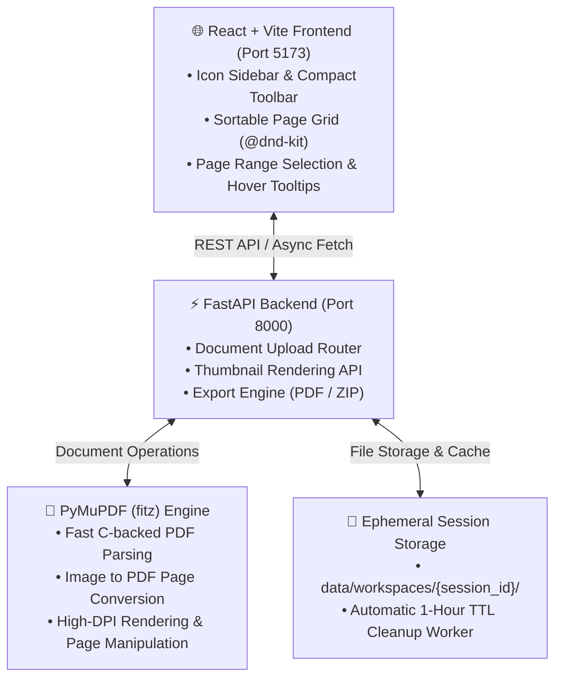

<div align="center" id="top">

[繁體中文](README.md) | **English**

<!-- HEADER STYLE: CLASSIC -->
<div align="center">

# walmart version of iLovePDF

<em>Visually rearrange, merge, and split PDFs — locally, privately.</em>

<!-- BADGES -->


<em>Built with the tools and technologies:</em>


</div>
<br>

</div>

---

## Table of Contents

- [Overview](#overview)
- [Architecture](#architecture)
- [Features](#features)
- [Project Structure](#project-structure)
    - [Project Index](#project-index)
- [Getting Started](#getting-started)
    - [Option A: Windows App (.exe)](#option-a-windows-app-exe)
    - [Option B: Run from Source](#option-b-run-from-source)
    - [Manual Setup](#manual-setup)
    - [Testing](#testing)
- [Building the Windows Executable](#building-the-windows-executable)
- [Architecture Decisions (ADR)](#architecture-decisions-adr)
- [Contributing](#contributing)
- [License](#license)
- [Acknowledgments](#acknowledgments)

---

## Overview

**walmart version of iLovePDF** is an iLovePDF-like visual workbench for PDFs and images. Every page of every uploaded file is rendered as a thumbnail card on one canvas, where you select, drag to reorder, rotate, delete, and export — no page numbers to type unless you want to.

**Why walmart version of iLovePDF?**

This project turns page-level PDF editing into direct manipulation, and keeps every file on your own machine. The core features include:

- 🟦 **Visual canvas:** Thumbnails rendered server-side by PyMuPDF, reordered with drag-and-drop across multiple files.
- 🟦 **Dense workbench UI:** Icon sidebar, compact toolbar, up to 8 columns of pages, and hover tooltips on nearly every control.
- 🟦 **Two ways to select:** Click cards, or type a range like `1-5, 8, 12-20`.
- 🟩 **PDF or images out:** Export a merged PDF, or a ZIP of 150-DPI PNGs.
- 🟩 **Private by default:** No accounts, no database; workspaces are purged after an hour.
- 🟩 **One-file Windows app:** A single `WalmartPDF.exe` — no Python or Node.js on the target machine.

---

## Architecture



In the packaged `WalmartPDF.exe`, FastAPI also serves the pre-built frontend from the same origin, so the whole app runs as one process on one port.

---

## Features

|      | Component         | Details |
| :--- | :---------------- | :------ |
| ⚙️  | **Architecture**  | <ul><li>Decoupled React SPA + FastAPI REST backend</li><li>Frontend holds the page order as a flat `PageNode[]`; backend compiles it on export</li><li>Single-process packaged mode: FastAPI mounts `frontend/dist` via `StaticFiles`</li><li>Background `lifespan` task purges idle workspaces</li></ul> |
| 🔩 | **Code Quality**  | <ul><li>TypeScript throughout the frontend</li><li>Pydantic models validate export requests</li><li>Stateless, props-driven card and toolbar components</li></ul> |
| 📄 | **Documentation** | <ul><li>Four ADRs under `docs/adr`</li><li>Domain glossary in `CONTEXT.md`</li></ul> |
| 🔌 | **Integrations**  | <ul><li>`PyMuPDF` for parsing, rendering, and PDF assembly</li><li>`Pillow` for image validation, thumbnails, and rotation</li><li>`@dnd-kit` for sortable drag-and-drop</li><li>`PyInstaller` for the single-file Windows build</li></ul> |
| 🧩 | **Modularity**    | <ul><li>Backend split into `api/`, `core/`, `services/`</li><li>Frontend split into `Upload/`, `Canvas/`, `Toolbar/`, plus shared `Sidebar` and `Tooltip`</li></ul> |
| ⚡️  | **Performance**   | <ul><li>C-backed MuPDF rendering</li><li>~300 px thumbnails, cached to disk after the first render</li><li>Exports saved with `garbage=4`, `deflate=True`</li></ul> |
| 🛡️ | **Security**      | <ul><li>`session_id` and file names must match server-generated UUID patterns</li><li>Resolved upload paths are checked against the workspace directory</li><li>Content sniffing (`%PDF-` header, `Image.verify()`) rejects renamed files</li><li>50 MB upload cap</li><li>Packaged app binds to `127.0.0.1` only</li></ul> |
| 📦 | **Dependencies**  | <ul><li>Backend: `fastapi`, `uvicorn[standard]`, `pymupdf`, `python-multipart`, `pydantic`, `pillow`</li><li>Frontend: `react`, `@dnd-kit/*`, `lucide-react`, `tailwindcss`, `vite`</li></ul> |

---

## Project Structure

```sh
└── walmart-ver.-of-iLovePDF/
    ├── .readmeaiignore
    ├── CONTEXT.md
    ├── LICENSE
    ├── README.md
    ├── README.en.md
    ├── WalmartPDF.spec
    ├── backend/
    │   ├── app/
    │   ├── desktop.py
    │   └── requirements.txt
    ├── build.ps1
    ├── docs/
    │   └── adr/
    ├── frontend/
    │   ├── index.html
    │   ├── package-lock.json
    │   ├── package.json
    │   ├── postcss.config.js
    │   ├── src/
    │   ├── tailwind.config.js
    │   ├── tsconfig.json
    │   └── vite.config.ts
    ├── start.bat
    ├── start.ps1
    └── start.sh
```

### Project Index

<details open>
	<summary><b><code>WALMART-VER.-OF-ILOVEPDF/</code></b></summary>
	<!-- __root__ Submodule -->
	<details>
		<summary><b>__root__</b></summary>
		<blockquote>
			<div class='directory-path' style='padding: 8px 0; color: #666;'>
				<code><b>⦿ __root__</b></code>
			<table style='width: 100%; border-collapse: collapse;'>
			<thead>
				<tr style='background-color: #f8f9fa;'>
					<th style='width: 30%; text-align: left; padding: 8px;'>File Name</th>
					<th style='text-align: left; padding: 8px;'>Summary</th>
				</tr>
			</thead>
				<tr style='border-bottom: 1px solid #eee;'>
					<td style='padding: 8px;'><b><a href='https://github.com/rowing195/walmart-ver.-of-iLovePDF/blob/main/build.ps1'>build.ps1</a></b></td>
					<td style='padding: 8px;'>Produces the distributable single-file Windows executable. Checks for Node.js, npm, and Python, builds the frontend with a clean install, prepares an isolated build virtualenv so developer packages cannot leak into the bundle, installs PyInstaller, and runs the spec. Fails fast with a clear message at each stage and reports the final executable size.</td>
				</tr>
				<tr style='border-bottom: 1px solid #eee;'>
					<td style='padding: 8px;'><b><a href='https://github.com/rowing195/walmart-ver.-of-iLovePDF/blob/main/WalmartPDF.spec'>WalmartPDF.spec</a></b></td>
					<td style='padding: 8px;'>Defines how the backend and the built frontend are frozen into one console executable. Bundles the production SPA as data, declares uvicorn submodules that static analysis cannot discover, excludes tkinter to shrink the output, and deliberately disables UPX compression to avoid antivirus false positives and corrupted native libraries.</td>
				</tr>
				<tr style='border-bottom: 1px solid #eee;'>
					<td style='padding: 8px;'><b><a href='https://github.com/rowing195/walmart-ver.-of-iLovePDF/blob/main/start.bat'>start.bat</a></b></td>
					<td style='padding: 8px;'>Launches the full development stack on Windows with a double-click. Creates the Python virtualenv when missing, installs backend requirements and frontend packages, then starts the FastAPI server and the Vite dev server side by side, handling project paths that contain spaces and stopping with a readable error if any setup step fails.</td>
				</tr>
				<tr style='border-bottom: 1px solid #eee;'>
					<td style='padding: 8px;'><b><a href='https://github.com/rowing195/walmart-ver.-of-iLovePDF/blob/main/start.ps1'>start.ps1</a></b></td>
					<td style='padding: 8px;'>Provides the PowerShell flavour of the development launcher. Prepares the virtualenv and dependencies, opens separate windows for the uvicorn backend with reload and the Vite frontend, waits briefly for both to come up, and then opens the application in the default browser so a developer lands directly on a working canvas.</td>
				</tr>
				<tr style='border-bottom: 1px solid #eee;'>
					<td style='padding: 8px;'><b><a href='https://github.com/rowing195/walmart-ver.-of-iLovePDF/blob/main/start.sh'>start.sh</a></b></td>
					<td style='padding: 8px;'>Starts the development environment on Linux and macOS. Creates and activates the virtualenv, installs backend and frontend dependencies, runs uvicorn and the Vite dev server as background jobs, and registers an exit trap so stopping the script also shuts down both servers instead of leaving orphaned processes behind.</td>
				</tr>
				<tr style='border-bottom: 1px solid #eee;'>
					<td style='padding: 8px;'><b><a href='https://github.com/rowing195/walmart-ver.-of-iLovePDF/blob/main/CONTEXT.md'>CONTEXT.md</a></b></td>
					<td style='padding: 8px;'>Establishes the shared domain vocabulary used across code and documentation. Defines Documents as uploaded PDFs or images, Page Nodes as the atomic unit of editing, the Visual Canvas where nodes are arranged, and Export Jobs that turn canvas state into a merged PDF or a ZIP archive of page images.</td>
				</tr>
			</table>
		</blockquote>
	</details>
	<!-- backend Submodule -->
	<details>
		<summary><b>backend</b></summary>
		<blockquote>
			<div class='directory-path' style='padding: 8px 0; color: #666;'>
				<code><b>⦿ backend</b></code>
			<table style='width: 100%; border-collapse: collapse;'>
			<thead>
				<tr style='background-color: #f8f9fa;'>
					<th style='width: 30%; text-align: left; padding: 8px;'>File Name</th>
					<th style='text-align: left; padding: 8px;'>Summary</th>
				</tr>
			</thead>
				<tr style='border-bottom: 1px solid #eee;'>
					<td style='padding: 8px;'><b><a href='https://github.com/rowing195/walmart-ver.-of-iLovePDF/blob/main/backend/desktop.py'>desktop.py</a></b></td>
					<td style='padding: 8px;'>Serves as the entry point frozen into the Windows executable. Picks port 8000 or falls back to any free port, prints the running address to the console, and opens the browser only once the server actually accepts connections. Runs uvicorn on the main thread against the imported app object so the bundle behaves predictably and quits cleanly.</td>
				</tr>
				<tr style='border-bottom: 1px solid #eee;'>
					<td style='padding: 8px;'><b><a href='https://github.com/rowing195/walmart-ver.-of-iLovePDF/blob/main/backend/requirements.txt'>requirements.txt</a></b></td>
					<td style='padding: 8px;'>Pins the exact backend dependency versions shared by development and the packaged build. Covers the FastAPI web framework, the uvicorn ASGI server with standard extras, PyMuPDF for document work, python-multipart for file uploads, Pydantic for request validation, and Pillow for image verification, thumbnails, and rotation.</td>
				</tr>
			</table>
			<!-- app Submodule -->
			<details>
				<summary><b>app</b></summary>
				<blockquote>
					<div class='directory-path' style='padding: 8px 0; color: #666;'>
						<code><b>⦿ backend.app</b></code>
					<table style='width: 100%; border-collapse: collapse;'>
					<thead>
						<tr style='background-color: #f8f9fa;'>
							<th style='width: 30%; text-align: left; padding: 8px;'>File Name</th>
							<th style='text-align: left; padding: 8px;'>Summary</th>
						</tr>
					</thead>
						<tr style='border-bottom: 1px solid #eee;'>
							<td style='padding: 8px;'><b><a href='https://github.com/rowing195/walmart-ver.-of-iLovePDF/blob/main/backend/app/main.py'>main.py</a></b></td>
							<td style='padding: 8px;'>Assembles the FastAPI application. Registers CORS for local development, mounts all API routes under the api prefix, exposes a health endpoint, and runs the workspace cleanup loop through a lifespan handler that cancels it on shutdown. When a built frontend exists, also serves the single-page app from the same origin for packaged mode.</td>
						</tr>
					</table>
					<!-- api Submodule -->
					<details>
						<summary><b>api</b></summary>
						<blockquote>
							<div class='directory-path' style='padding: 8px 0; color: #666;'>
								<code><b>⦿ backend.app.api</b></code>
							<table style='width: 100%; border-collapse: collapse;'>
							<thead>
								<tr style='background-color: #f8f9fa;'>
									<th style='width: 30%; text-align: left; padding: 8px;'>File Name</th>
									<th style='text-align: left; padding: 8px;'>Summary</th>
								</tr>
							</thead>
								<tr style='border-bottom: 1px solid #eee;'>
									<td style='padding: 8px;'><b><a href='https://github.com/rowing195/walmart-ver.-of-iLovePDF/blob/main/backend/app/api/router.py'>router.py</a></b></td>
									<td style='padding: 8px;'>Combines the feature routers into one API router consumed by the application. Mounts document handling under a documents prefix and export handling under an export prefix, tagging each group so the automatically generated OpenAPI documentation stays organised by responsibility rather than presenting one flat list of endpoints.</td>
								</tr>
								<tr style='border-bottom: 1px solid #eee;'>
									<td style='padding: 8px;'><b><a href='https://github.com/rowing195/walmart-ver.-of-iLovePDF/blob/main/backend/app/api/endpoints/documents.py'>endpoints/documents.py</a></b></td>
									<td style='padding: 8px;'>Handles document intake and page previews. Accepts PDF and image uploads, enforces the allowed extensions and size cap, sniffs actual file content to reject disguised files, stores them in the session workspace, and returns page metadata. Also serves per-page thumbnails rendered on demand through the PDF service and cached for later requests.</td>
								</tr>
								<tr style='border-bottom: 1px solid #eee;'>
									<td style='padding: 8px;'><b><a href='https://github.com/rowing195/walmart-ver.-of-iLovePDF/blob/main/backend/app/api/endpoints/export.py'>endpoints/export.py</a></b></td>
									<td style='padding: 8px;'>Turns the canvas state sent by the frontend into downloadable files. Validates an ordered list of page nodes with their rotations, rejects file references that are not server-generated names, then delegates to the PDF service to produce either a single merged PDF or a ZIP archive of rendered page images.</td>
								</tr>
							</table>
						</blockquote>
					</details>
					<!-- core Submodule -->
					<details>
						<summary><b>core</b></summary>
						<blockquote>
							<div class='directory-path' style='padding: 8px 0; color: #666;'>
								<code><b>⦿ backend.app.core</b></code>
							<table style='width: 100%; border-collapse: collapse;'>
							<thead>
								<tr style='background-color: #f8f9fa;'>
									<th style='width: 30%; text-align: left; padding: 8px;'>File Name</th>
									<th style='text-align: left; padding: 8px;'>Summary</th>
								</tr>
							</thead>
								<tr style='border-bottom: 1px solid #eee;'>
									<td style='padding: 8px;'><b><a href='https://github.com/rowing195/walmart-ver.-of-iLovePDF/blob/main/backend/app/core/config.py'>config.py</a></b></td>
									<td style='padding: 8px;'>Centralises runtime settings and path resolution. Detects whether the app is running frozen inside the executable and, if so, reads bundled assets from the extraction directory while keeping user data in the local application data folder. Defines the one-hour workspace lifetime, the upload size limit, and the UUID patterns used to validate identifiers.</td>
								</tr>
								<tr style='border-bottom: 1px solid #eee;'>
									<td style='padding: 8px;'><b><a href='https://github.com/rowing195/walmart-ver.-of-iLovePDF/blob/main/backend/app/core/cleanup.py'>cleanup.py</a></b></td>
									<td style='padding: 8px;'>Implements the background garbage collector behind the privacy promise. Wakes every ten minutes, inspects each session workspace, and deletes any whose last modification is older than the configured lifetime, logging failures without crashing the loop so a single locked file never stops cleanup of the remaining workspaces.</td>
								</tr>
							</table>
						</blockquote>
					</details>
					<!-- services Submodule -->
					<details>
						<summary><b>services</b></summary>
						<blockquote>
							<div class='directory-path' style='padding: 8px 0; color: #666;'>
								<code><b>⦿ backend.app.services</b></code>
							<table style='width: 100%; border-collapse: collapse;'>
							<thead>
								<tr style='background-color: #f8f9fa;'>
									<th style='width: 30%; text-align: left; padding: 8px;'>File Name</th>
									<th style='text-align: left; padding: 8px;'>Summary</th>
								</tr>
							</thead>
								<tr style='border-bottom: 1px solid #eee;'>
									<td style='padding: 8px;'><b><a href='https://github.com/rowing195/walmart-ver.-of-iLovePDF/blob/main/backend/app/services/pdf_service.py'>pdf_service.py</a></b></td>
									<td style='padding: 8px;'>Performs all document processing with PyMuPDF and Pillow. Reads page counts and dimensions, renders and caches small page thumbnails, converts images into PDF pages, assembles an ordered and rotated set of pages into one compressed PDF, and renders selected pages into PNG images packed into a ZIP archive for download.</td>
								</tr>
								<tr style='border-bottom: 1px solid #eee;'>
									<td style='padding: 8px;'><b><a href='https://github.com/rowing195/walmart-ver.-of-iLovePDF/blob/main/backend/app/services/workspace_service.py'>workspace_service.py</a></b></td>
									<td style='padding: 8px;'>Manages per-session storage on disk. Creates UUID-named workspaces with upload, thumbnail, and export folders, saves uploads under server-generated names, and resolves requested file names back to real paths only when they stay inside the workspace upload folder, blocking path traversal through user-supplied identifiers.</td>
								</tr>
							</table>
						</blockquote>
					</details>
				</blockquote>
			</details>
		</blockquote>
	</details>
	<!-- frontend Submodule -->
	<details>
		<summary><b>frontend</b></summary>
		<blockquote>
			<div class='directory-path' style='padding: 8px 0; color: #666;'>
				<code><b>⦿ frontend</b></code>
			<table style='width: 100%; border-collapse: collapse;'>
			<thead>
				<tr style='background-color: #f8f9fa;'>
					<th style='width: 30%; text-align: left; padding: 8px;'>File Name</th>
					<th style='text-align: left; padding: 8px;'>Summary</th>
				</tr>
			</thead>
				<tr style='border-bottom: 1px solid #eee;'>
					<td style='padding: 8px;'><b><a href='https://github.com/rowing195/walmart-ver.-of-iLovePDF/blob/main/frontend/package.json'>package.json</a></b></td>
					<td style='padding: 8px;'>Declares the frontend package, its scripts, and dependencies. Provides dev, type-checked production build, and preview commands for Vite, and lists React, the dnd-kit drag-and-drop packages, and Lucide icons at runtime, alongside TypeScript, Tailwind CSS, PostCSS, and the Vite React plugin as build-time tooling.</td>
				</tr>
				<tr style='border-bottom: 1px solid #eee;'>
					<td style='padding: 8px;'><b><a href='https://github.com/rowing195/walmart-ver.-of-iLovePDF/blob/main/frontend/vite.config.ts'>vite.config.ts</a></b></td>
					<td style='padding: 8px;'>Configures the Vite development server for the React application. Fixes the dev port at 5173 and proxies every api request to the FastAPI backend on port 8000, so the frontend can use relative URLs that work identically in development and in the packaged single-origin executable without any environment-specific code.</td>
				</tr>
				<tr style='border-bottom: 1px solid #eee;'>
					<td style='padding: 8px;'><b><a href='https://github.com/rowing195/walmart-ver.-of-iLovePDF/blob/main/frontend/tailwind.config.js'>tailwind.config.js</a></b></td>
					<td style='padding: 8px;'>Sets up Tailwind CSS scanning and theme extensions for the interface. Points content detection at the HTML shell and all TypeScript sources, and maps the sans and mono font families to IBM Plex Sans and IBM Plex Mono, giving the dense workbench its consistent typography across labels, badges, and file names.</td>
				</tr>
				<tr style='border-bottom: 1px solid #eee;'>
					<td style='padding: 8px;'><b><a href='https://github.com/rowing195/walmart-ver.-of-iLovePDF/blob/main/frontend/index.html'>index.html</a></b></td>
					<td style='padding: 8px;'>Provides the HTML shell that Vite injects the React application into. Loads the IBM Plex font families from Google Fonts, applies the dark neutral page background, text color, and selection highlight at the body level, and hosts the root element where the entire workbench interface is mounted at runtime.</td>
				</tr>
			</table>
			<!-- src Submodule -->
			<details>
				<summary><b>src</b></summary>
				<blockquote>
					<div class='directory-path' style='padding: 8px 0; color: #666;'>
						<code><b>⦿ frontend.src</b></code>
					<table style='width: 100%; border-collapse: collapse;'>
					<thead>
						<tr style='background-color: #f8f9fa;'>
							<th style='width: 30%; text-align: left; padding: 8px;'>File Name</th>
							<th style='text-align: left; padding: 8px;'>Summary</th>
						</tr>
					</thead>
						<tr style='border-bottom: 1px solid #eee;'>
							<td style='padding: 8px;'><b><a href='https://github.com/rowing195/walmart-ver.-of-iLovePDF/blob/main/frontend/src/App.tsx'>App.tsx</a></b></td>
							<td style='padding: 8px;'>Owns application state and layout for the whole workbench. Holds the session, the ordered page nodes, selection, rotation, and range-selection handlers, plus upload and export flows that trigger file downloads. Renders the sidebar, header with a live workspace countdown, a floating toast, and either the full-size drop zone or the toolbar and page grid.</td>
						</tr>
						<tr style='border-bottom: 1px solid #eee;'>
							<td style='padding: 8px;'><b><a href='https://github.com/rowing195/walmart-ver.-of-iLovePDF/blob/main/frontend/src/index.css'>index.css</a></b></td>
							<td style='padding: 8px;'>Defines global styles on top of Tailwind. Sets the IBM Plex typography, prevents page-level horizontal scrolling, themes scrollbars in the blue accent, and implements the hover tooltip mechanism, which reveals a bubble after a one-second hover, hides it instantly on leave, and supports below, above, and right placements with arrows.</td>
						</tr>
						<tr style='border-bottom: 1px solid #eee;'>
							<td style='padding: 8px;'><b><a href='https://github.com/rowing195/walmart-ver.-of-iLovePDF/blob/main/frontend/src/main.tsx'>main.tsx</a></b></td>
							<td style='padding: 8px;'>Bootstraps the React application. Imports the global stylesheet, locates the root element in the HTML shell, and renders the main App component inside React strict mode, which surfaces unsafe lifecycle usage and accidental side effects during development without affecting the production build that ships inside the Windows executable.</td>
						</tr>
					</table>
					<!-- components Submodule -->
					<details>
						<summary><b>components</b></summary>
						<blockquote>
							<div class='directory-path' style='padding: 8px 0; color: #666;'>
								<code><b>⦿ frontend.src.components</b></code>
							<table style='width: 100%; border-collapse: collapse;'>
							<thead>
								<tr style='background-color: #f8f9fa;'>
									<th style='width: 30%; text-align: left; padding: 8px;'>File Name</th>
									<th style='text-align: left; padding: 8px;'>Summary</th>
								</tr>
							</thead>
								<tr style='border-bottom: 1px solid #eee;'>
									<td style='padding: 8px;'><b><a href='https://github.com/rowing195/walmart-ver.-of-iLovePDF/blob/main/frontend/src/components/Sidebar.tsx'>Sidebar.tsx</a></b></td>
									<td style='padding: 8px;'>Renders the narrow icon navigation rail on the left edge of the workbench. Shows the product mark, the active page overview entry, and placeholders for layers, version history, and workspace settings marked as coming soon, each labelled with a tooltip and an accessible name so the compact icons remain self-explanatory to new users.</td>
								</tr>
								<tr style='border-bottom: 1px solid #eee;'>
									<td style='padding: 8px;'><b><a href='https://github.com/rowing195/walmart-ver.-of-iLovePDF/blob/main/frontend/src/components/Tooltip.tsx'>Tooltip.tsx</a></b></td>
									<td style='padding: 8px;'>Provides a lightweight reusable hover tooltip wrapper. Surrounds any control and attaches a label bubble placed below, above, or to the right, relying entirely on the shared stylesheet for the delayed reveal, so the toolbar, sidebar, and page cards can explain themselves without occupying any permanent layout space.</td>
								</tr>
								<tr style='border-bottom: 1px solid #eee;'>
									<td style='padding: 8px;'><b><a href='https://github.com/rowing195/walmart-ver.-of-iLovePDF/blob/main/frontend/src/components/Upload/FileUploader.tsx'>Upload/FileUploader.tsx</a></b></td>
									<td style='padding: 8px;'>Presents the empty-state drop zone that fills most of the workspace. Accepts files by drag-and-drop or through a hidden file picker restricted to PDFs and common image formats, forwards them to the application for upload, and swaps its icon for a spinner while pages are being uploaded and rendered.</td>
								</tr>
								<tr style='border-bottom: 1px solid #eee;'>
									<td style='padding: 8px;'><b><a href='https://github.com/rowing195/walmart-ver.-of-iLovePDF/blob/main/frontend/src/components/Toolbar/ActionsToolbar.tsx'>Toolbar/ActionsToolbar.tsx</a></b></td>
									<td style='padding: 8px;'>Hosts every bulk action in one compact toolbar. Inserts more files, toggles select-all, parses page range expressions such as 1-5, 8 into a live selection while flagging invalid input, rotates or deletes the selection, shows the selected count, and triggers merged PDF or PNG ZIP exports, with tooltips on each control.</td>
								</tr>
								<tr style='border-bottom: 1px solid #eee;'>
									<td style='padding: 8px;'><b><a href='https://github.com/rowing195/walmart-ver.-of-iLovePDF/blob/main/frontend/src/components/Canvas/VisualCanvas.tsx'>Canvas/VisualCanvas.tsx</a></b></td>
									<td style='padding: 8px;'>Lays out all page cards in a responsive grid of up to eight columns and makes them sortable. Configures dnd-kit pointer and keyboard sensors with a small activation distance so clicks are not mistaken for drags, and writes the reordered page list back to the application when a drag completes.</td>
								</tr>
								<tr style='border-bottom: 1px solid #eee;'>
									<td style='padding: 8px;'><b><a href='https://github.com/rowing195/walmart-ver.-of-iLovePDF/blob/main/frontend/src/components/Canvas/PageCard.tsx'>Canvas/PageCard.tsx</a></b></td>
									<td style='padding: 8px;'>Displays a single page as a draggable card. Shows the source file name, a server-rendered thumbnail rotated to the current angle, the page position and rotation badges, and controls for selection, left and right rotation, and deletion, raising its stacking order only while dragged so neighbouring tooltips are never covered.</td>
								</tr>
							</table>
						</blockquote>
					</details>
					<!-- services Submodule -->
					<details>
						<summary><b>services</b></summary>
						<blockquote>
							<div class='directory-path' style='padding: 8px 0; color: #666;'>
								<code><b>⦿ frontend.src.services</b></code>
							<table style='width: 100%; border-collapse: collapse;'>
							<thead>
								<tr style='background-color: #f8f9fa;'>
									<th style='width: 30%; text-align: left; padding: 8px;'>File Name</th>
									<th style='text-align: left; padding: 8px;'>Summary</th>
								</tr>
							</thead>
								<tr style='border-bottom: 1px solid #eee;'>
									<td style='padding: 8px;'><b><a href='https://github.com/rowing195/walmart-ver.-of-iLovePDF/blob/main/frontend/src/services/api.ts'>api.ts</a></b></td>
									<td style='padding: 8px;'>Wraps every backend call used by the interface. Uploads files as multipart form data while reusing the current session, builds thumbnail URLs for page cards, and posts export recipes to receive merged PDF or ZIP archives as binary blobs, converting failed responses into readable errors surfaced through the toast notification.</td>
								</tr>
							</table>
						</blockquote>
					</details>
					<!-- types Submodule -->
					<details>
						<summary><b>types</b></summary>
						<blockquote>
							<div class='directory-path' style='padding: 8px 0; color: #666;'>
								<code><b>⦿ frontend.src.types</b></code>
							<table style='width: 100%; border-collapse: collapse;'>
							<thead>
								<tr style='background-color: #f8f9fa;'>
									<th style='width: 30%; text-align: left; padding: 8px;'>File Name</th>
									<th style='text-align: left; padding: 8px;'>Summary</th>
								</tr>
							</thead>
								<tr style='border-bottom: 1px solid #eee;'>
									<td style='padding: 8px;'><b><a href='https://github.com/rowing195/walmart-ver.-of-iLovePDF/blob/main/frontend/src/types/index.ts'>index.ts</a></b></td>
									<td style='padding: 8px;'>Defines the shared TypeScript shapes exchanged between components and the backend. Describes uploaded documents with their page dimensions, the page node that represents one card with its source, index, rotation, and selection state, and the export recipe that carries the ordered, rotated page list to the server.</td>
								</tr>
							</table>
						</blockquote>
					</details>
				</blockquote>
			</details>
		</blockquote>
	</details>
</details>

---

## Getting Started

### Option A: Windows App (.exe)

**No Python, no Node.js, no installation.** Download `WalmartPDF.exe` from the
[latest release](https://github.com/rowing195/walmart-ver.-of-iLovePDF/releases/latest) and double-click it.

It starts a local server, opens your browser automatically, and serves the whole
app from that single file. Everything runs on your own machine — nothing is
uploaded anywhere.

> [!NOTE]
> **First launch shows a SmartScreen warning.** The executable is not code-signed,
> so Windows displays *"Windows protected your PC — Unknown publisher."*
> Click **More info → Run anyway**. This is expected for any unsigned application.

A black console window stays open while the app runs — **close it to quit**.
Your working files are stored in `%LOCALAPPDATA%\WalmartPDF\workspaces` and are
purged automatically one hour after a session goes idle.

If port `8000` is already in use, the app picks a free port automatically and
opens the browser at that address.

---

### Option B: Run from Source

**Prerequisites**

This project requires the following dependencies:

- **Programming Languages:** Python `3.10+`, TypeScript
- **Package Managers:** pip, npm (Node.js `18+`)

On Windows, simply double-click **`start.bat`** in the project root directory
(macOS / Linux: run `./start.sh`).

The script automatically:
1. Creates Python virtual environment (`.venv`) if missing.
2. Installs Python dependencies (`pymupdf`, `fastapi`, `uvicorn`, etc.).
3. Installs frontend `npm` packages.
4. Launches FastAPI Backend on `http://localhost:8000` and Vite Frontend on `http://localhost:5173`.
5. Opens your default browser automatically.

This is the development setup: the Vite dev server provides hot reload, and
proxies `/api` requests to the backend.

---

### Manual Setup

1. **Clone the repository:**

    ```sh
    ❯ git clone https://github.com/rowing195/walmart-ver.-of-iLovePDF
    ```

2. **Navigate to the project directory:**

    ```sh
    ❯ cd walmart-ver.-of-iLovePDF
    ```

3. **Set up and run the backend:**

    ```sh
    ❯ python -m venv .venv
    ❯ source .venv/bin/activate  # On Windows: .venv\Scripts\activate
    ❯ pip install -r backend/requirements.txt
    ❯ python -m uvicorn app.main:app --reload --port 8000 --app-dir backend
    ```

4. **In a second terminal, set up and run the frontend:**

    ```sh
    ❯ cd frontend
    ❯ npm install
    ❯ npm run dev
    ```

Open `http://localhost:5173` in your browser.

---

### Testing

The project does not include an automated test suite yet. The frontend build
does run a TypeScript type check:

```sh
❯ cd frontend
❯ npm run build
```

---

## Building the Windows Executable

From the project root, in PowerShell:

```powershell
.\build.ps1
```

If PowerShell refuses with *"running scripts is disabled on this system"*, your
execution policy blocks local scripts. Run it once with a bypass instead:

```powershell
powershell -ExecutionPolicy Bypass -File build.ps1
```

The result is **`dist\WalmartPDF.exe`** (~40 MB) — a single self-contained file
that runs on any Windows machine without Python or Node.js installed.

**What the script does:**

| Step | Action |
| :--- | :--- |
| 1 | Verifies `node`, `npm`, and `python` are on `PATH` |
| 2 | `npm ci` + `npm run build` → produces `frontend/dist` |
| 3 | Creates `.build-venv` and installs backend requirements + PyInstaller |
| 4 | Runs PyInstaller against `WalmartPDF.spec` |

**Requirements for building** (the end user needs none of these):

- **Windows** — PyInstaller cannot cross-compile, so a Windows `.exe` must be built on Windows.
- Node.js `18+` and Python `3.10+`.

> [!IMPORTANT]
> **Close any running `WalmartPDF.exe` before rebuilding.** A running instance
> locks `dist\WalmartPDF.exe` and PyInstaller fails with
> `PermissionError: [WinError 5] Access is denied`:
> ```powershell
> Stop-Process -Name WalmartPDF -Force -ErrorAction SilentlyContinue
> ```

The first build takes a few minutes (`npm ci` plus creating the virtualenv);
subsequent builds take about two minutes, since `.build-venv` is reused.

**Rebuild after any change.** The frontend inside the executable is a snapshot of
`frontend/dist` taken at build time — it does not update on its own. During
development use `start.bat` instead, which gives you hot reload, and package once
the change is final.

### How the packaged app differs from dev mode

| | Dev mode (`start.bat`) | Packaged (`WalmartPDF.exe`) |
| :--- | :--- | :--- |
| Processes | Two (Vite `5173` + FastAPI `8000`) | One, serving API and UI on the same port |
| Frontend | Vite dev server, hot reload | Pre-built static files served by FastAPI |
| Port | Fixed `5173` / `8000` | Prefers `8000`, falls back to any free port |
| Working data | `backend/data/workspaces` | `%LOCALAPPDATA%\WalmartPDF\workspaces` |

---

## Architecture Decisions (ADR)

The key design choices behind walmart version of iLovePDF are documented in the [docs/adr](docs/adr) directory:

- [ADR 0001: Server-side Thumbnail Rendering with PyMuPDF](docs/adr/0001-server-side-thumbnail-rendering-with-pymupdf.md)
- [ADR 0002: Ephemeral Local Session Storage without Database](docs/adr/0002-ephemeral-local-session-storage.md)
- [ADR 0003: Tech Stack Selection: FastAPI and React](docs/adr/0003-tech-stack-fastapi-react.md)
- [ADR 0004: One-Command Startup Script for Local Development](docs/adr/0004-one-command-startup-script.md)

---

## Contributing

- **🐛 [Report Issues](https://github.com/rowing195/walmart-ver.-of-iLovePDF/issues)**: Submit bugs found or log feature requests.
- **💡 [Submit Pull Requests](https://github.com/rowing195/walmart-ver.-of-iLovePDF/pulls)**: Review open PRs, and submit your own PRs.

<details closed>
<summary>Contributing Guidelines</summary>

1. **Fork the Repository**: Start by forking the project repository to your github account.
2. **Clone Locally**: Clone the forked repository to your local machine using a git client.
   ```sh
   git clone https://github.com/rowing195/walmart-ver.-of-iLovePDF
   ```
3. **Create a New Branch**: Always work on a new branch, giving it a descriptive name.
   ```sh
   git checkout -b new-feature-x
   ```
4. **Make Your Changes**: Develop and test your changes locally.
5. **Commit Your Changes**: Commit with a clear message describing your updates.
   ```sh
   git commit -m 'Implemented new feature x.'
   ```
6. **Push to github**: Push the changes to your forked repository.
   ```sh
   git push origin new-feature-x
   ```
7. **Submit a Pull Request**: Create a PR against the original project repository.
8. **Review**: Once your PR is reviewed and approved, it will be merged.

</details>

<details closed>
<summary>Contributor Graph</summary>
<br>
<p align="left">
   <a href="https://github.com/rowing195/walmart-ver.-of-iLovePDF/graphs/contributors">
      
   </a>
</p>
</details>

---

## License

walmart version of iLovePDF is protected under the [MIT](LICENSE) License.

---

## Acknowledgments

- Inspired by [iLovePDF](https://www.ilovepdf.com/); this project is an independent clone and is not affiliated with it.
- [PyMuPDF](https://github.com/pymupdf/PyMuPDF) for PDF parsing, rendering, and assembly.
- [FastAPI](https://github.com/fastapi/fastapi) and [Uvicorn](https://github.com/encode/uvicorn) for the backend.
- [dnd kit](https://github.com/clauderic/dnd-kit) for sortable drag-and-drop.
- [Lucide](https://github.com/lucide-icons/lucide) for icons.
- [PyInstaller](https://github.com/pyinstaller/pyinstaller) for the single-file Windows build.

<div align="left"><a href="#top">Back to top</a></div>

---
