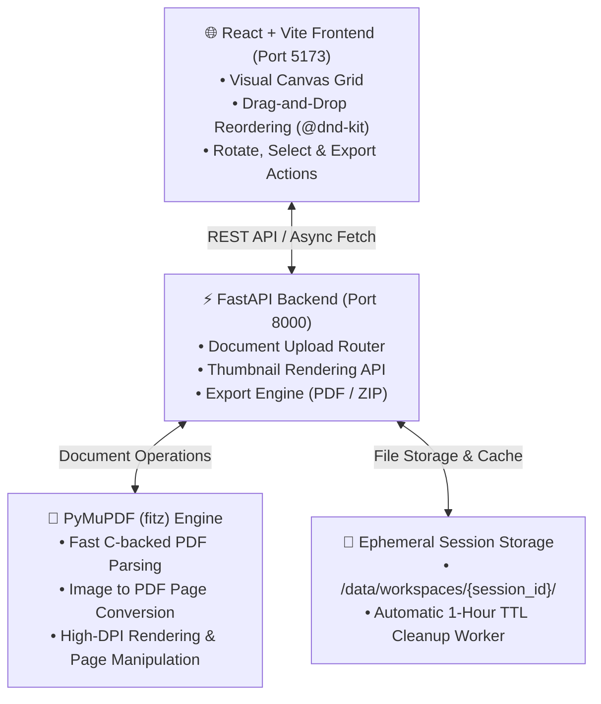

<div id="top">

<div align="center">

<h1 align="center">📄 walmart version of iLovePDF</h1>
<p align="center">
  <em>High-Performance Visual PDF & Image Workbench Powered by PyMuPDF & React</em>
</p>

<!-- BADGES -->
<p align="center">
  
  
  
  
  
  
  
</p>

</div>

<br>

---

## 📋 Table of Contents

- [Overview](#overview)
- [Architecture](#architecture)
- [Features](#features)
- [Project Structure](#project-structure)
- [Getting Started](#getting-started)
    - [Option A: Windows App (.exe)](#option-a-windows-app-exe)
    - [Option B: Run from Source](#option-b-run-from-source)
    - [Manual Setup](#manual-setup)
- [Building the Windows Executable](#building-the-windows-executable)
- [Architecture Decisions (ADR)](#architecture-decisions-adr)
- [License](#license)

---

## 🌟 Overview

**walmart version of iLovePDF** is an iLovePDF-like open-source web workbench designed for visual PDF page manipulation, reordering, splitting, merging, rotating, image conversion, and extraction. 

Unlike conventional PDF tools that require typing page numbers, **walmart version of iLovePDF** provides an interactive **Visual Canvas** where every page of uploaded PDFs and images is rendered on the fly as thumbnail cards. Users can visually select, drag-and-drop to reorder, rotate, insert images, and export custom PDFs or ZIP image packages with ease.

---

## 🏗️ Architecture



---

## ✨ Features

- 🖼️ **Visual Page Selector Grid**: Real-time server-side thumbnail rendering powered by PyMuPDF (`fitz`).
- 🔀 **Drag-and-Drop Page Reordering**: Effortlessly reorder pages across multiple PDFs using `@dnd-kit`.
- 🔢 **Page Range Selection**: Type `1-5, 8, 12-20` to select pages by number instead of clicking each card. Selection updates live as you type.
- 🔄 **Page Rotation & Deletion**: Rotate individual pages or selected batches by 90° increments or remove unneeded pages.
- 🖼️➡️📄 **Image to PDF Insertion**: Upload PNG, JPG, WebP images directly to insert them as formatted pages into any PDF.
- 📄➡️🖼️ **ZIP Image Extraction**: Select specific pages and extract them as high-resolution PNG image packages.
- 🔐 **Privacy-First Ephemeral Workspaces**: No database, no user accounts. Workspaces are automatically purged after 1 hour.
- 📦 **Single-File Windows App**: Ships as one self-contained `WalmartPDF.exe` — no Python, no Node.js, no installer required on the target machine.
- ⚡ **One-Click Double-Click Startup**: Includes `start.bat`, `start.ps1`, and `start.sh` for instant local setup.

---

## 📁 Project Structure

```sh
ilovepdf-clone/
├── start.bat                                  # Windows double-click launcher (dev)
├── start.ps1                                  # PowerShell launcher (dev)
├── start.sh                                   # Linux / macOS launcher (dev)
├── build.ps1                                  # Builds dist/WalmartPDF.exe
├── WalmartPDF.spec                            # PyInstaller bundle configuration
├── CONTEXT.md                                 # Domain Glossary
├── README.md                                  # Project Documentation
├── docs/
│   └── adr/                                   # Architectural Decision Records
│       ├── 0001-server-side-thumbnail-rendering-with-pymupdf.md
│       ├── 0002-ephemeral-local-session-storage.md
│       ├── 0003-tech-stack-fastapi-react.md
│       └── 0004-one-command-startup-script.md
├── backend/
│   ├── requirements.txt                       # Python dependencies
│   ├── desktop.py                             # Packaged-app entrypoint (frozen into the .exe)
│   └── app/
│       ├── main.py                            # FastAPI entrypoint
│       ├── api/                               # API endpoints (documents, export)
│       ├── core/                              # Config & workspace cleanup worker
│       └── services/                          # PyMuPDF & Workspace services
└── frontend/
    ├── package.json                           # Frontend dependencies
    ├── vite.config.ts                         # Vite configuration & proxy
    └── src/
        ├── App.tsx                            # Main App component
        ├── components/
        │   ├── Upload/FileUploader.tsx        # Drag-and-drop uploader
        │   ├── Canvas/VisualCanvas.tsx        # Sortable grid canvas
        │   ├── Canvas/PageCard.tsx            # Thumbnail card component
        │   └── Toolbar/ActionsToolbar.tsx    # Operation toolbar
        └── services/api.ts                    # Axios/Fetch API client
```

---

## 🚀 Getting Started

### Option A: Windows App (.exe)

**No Python, no Node.js, no installation.** Download `WalmartPDF.exe` from the
[latest release](../../releases/latest) and double-click it.

It starts a local server, opens your browser automatically, and serves the whole
app from that single file. Everything runs on your own machine — nothing is
uploaded anywhere.

> [!NOTE]
> **First launch shows a SmartScreen warning.** The executable is not code-signed,
> so Windows displays *"Windows protected your PC — Unknown publisher."*
> Click **More info → Run anyway**. This is expected for any unsigned application.

A black console window stays open while the app runs — **close it to quit**.
Your working files are stored in `%LOCALAPPDATA%\WalmartPDF\workspaces` and are
purged automatically one hour after a session goes idle.

If port `8000` is already in use, the app picks a free port automatically and
opens the browser at that address.

---

### Option B: Run from Source

**Prerequisites**

- **Python**: `3.10` or higher
- **Node.js**: `18.0` or higher (`npm` included)

On Windows, simply double-click **`start.bat`** in the project root directory
(macOS / Linux: run `./start.sh`).

The script automatically:
1. Creates Python virtual environment (`.venv`) if missing.
2. Installs Python dependencies (`pymupdf`, `fastapi`, `uvicorn`, etc.).
3. Installs frontend `npm` packages.
4. Launches FastAPI Backend on `http://localhost:8000` and Vite Frontend on `http://localhost:5173`.
5. Opens your default browser automatically.

This is the development setup: the Vite dev server provides hot reload, and
proxies `/api` requests to the backend.

---

### Manual Setup

#### 1. Backend Setup

```bash
# Navigate to backend and create virtualenv
python -m venv .venv
source .venv/bin/activate  # On Windows: .venv\Scripts\activate

# Install requirements
pip install -r backend/requirements.txt

# Run FastAPI backend
python -m uvicorn app.main:app --reload --port 8000 --app-dir backend
```

#### 2. Frontend Setup

```bash
# Navigate to frontend
cd frontend

# Install dependencies
npm install

# Start Vite dev server
npm run dev
```

Open `http://localhost:5173` in your browser.

---

## 📦 Building the Windows Executable

From the project root, in PowerShell:

```powershell
.\build.ps1
```

The result is **`dist\WalmartPDF.exe`** (~42 MB) — a single self-contained file
that runs on any Windows machine without Python or Node.js installed.

**What the script does:**

| Step | Action |
| :--- | :--- |
| 1 | Verifies `node`, `npm`, and `python` are on `PATH` |
| 2 | `npm ci` + `npm run build` → produces `frontend/dist` |
| 3 | Creates `.build-venv` and installs backend requirements + PyInstaller |
| 4 | Runs PyInstaller against `WalmartPDF.spec` |

**Requirements for building** (the end user needs none of these):

- **Windows** — PyInstaller cannot cross-compile, so a Windows `.exe` must be built on Windows.
- Node.js `18+` and Python `3.10+`.

> [!IMPORTANT]
> **Close any running `WalmartPDF.exe` before rebuilding.** A running instance
> locks `dist\WalmartPDF.exe` and PyInstaller will fail to overwrite it:
> ```powershell
> Stop-Process -Name WalmartPDF -Force -ErrorAction SilentlyContinue
> ```

The first build takes a few minutes (`npm ci` plus creating the virtualenv);
subsequent builds take about two minutes, since `.build-venv` is reused.

**Rebuild after any change.** The frontend inside the executable is a snapshot of
`frontend/dist` taken at build time — it does not update on its own. During
development use `start.bat` instead, which gives you hot reload, and package once
the change is final.

### How the packaged app differs from dev mode

| | Dev mode (`start.bat`) | Packaged (`WalmartPDF.exe`) |
| :--- | :--- | :--- |
| Processes | Two (Vite `5173` + FastAPI `8000`) | One, serving API and UI on the same port |
| Frontend | Vite dev server, hot reload | Pre-built static files served by FastAPI |
| Port | Fixed `5173` / `8000` | Prefers `8000`, falls back to any free port |
| Working data | `backend/data/workspaces` | `%LOCALAPPDATA%\WalmartPDF\workspaces` |

---

## 🏛️ Architecture Decisions (ADR)

The key design choices behind walmart version of iLovePDF are documented in the [docs/adr](docs/adr) directory:

- [ADR 0001: Server-side Thumbnail Rendering with PyMuPDF](docs/adr/0001-server-side-thumbnail-rendering-with-pymupdf.md)
- [ADR 0002: Ephemeral Local Session Storage without Database](docs/adr/0002-ephemeral-local-session-storage.md)
- [ADR 0003: Tech Stack Selection: FastAPI and React](docs/adr/0003-tech-stack-fastapi-react.md)
- [ADR 0004: One-Command Startup Script for Local Development](docs/adr/0004-one-command-startup-script.md)

---

## 📄 License

This project is open-source under the [MIT License](LICENSE).
