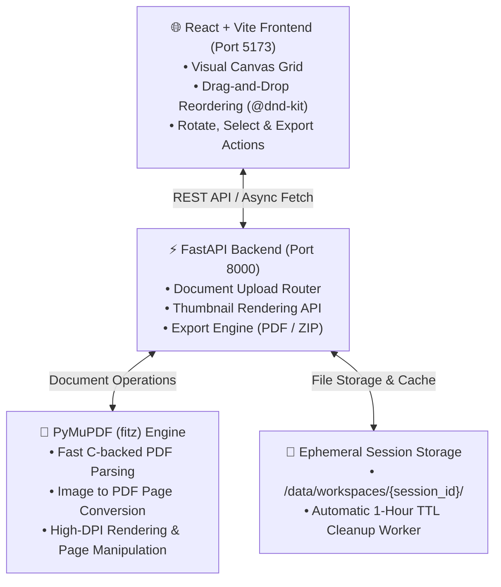

<div id="top">

<div align="center">

<h1 align="center">📄 walmart version of iLovePDF</h1>
<p align="center">
  <em>High-Performance Visual PDF & Image Workbench Powered by PyMuPDF & React</em>
</p>

<!-- BADGES -->
<p align="center">
  
  
  
  
  
  
  
</p>

</div>

<br>

---

## 📋 Table of Contents

- [Overview](#overview)
- [Architecture](#architecture)
- [Features](#features)
- [Project Structure](#project-structure)
- [Getting Started](#getting-started)
    - [Prerequisites](#prerequisites)
    - [One-Click Launch (Windows)](#one-click-launch-windows)
    - [Manual Setup](#manual-setup)
- [Architecture Decisions (ADR)](#architecture-decisions-adr)
- [License](#license)

---

## 🌟 Overview

**PDF Craft** is an iLovePDF-like open-source web workbench designed for visual PDF page manipulation, reordering, splitting, merging, rotating, image conversion, and extraction. 

Unlike conventional PDF tools that require typing page numbers, **PDF Craft** provides an interactive **Visual Canvas** where every page of uploaded PDFs and images is rendered on the fly as thumbnail cards. Users can visually select, drag-and-drop to reorder, rotate, insert images, and export custom PDFs or ZIP image packages with ease.

---

## 🏗️ Architecture



---

## ✨ Features

- 🖼️ **Visual Page Selector Grid**: Real-time server-side thumbnail rendering powered by PyMuPDF (`fitz`).
- 🔀 **Drag-and-Drop Page Reordering**: Effortlessly reorder pages across multiple PDFs using `@dnd-kit`.
- 🔄 **Page Rotation & Deletion**: Rotate individual pages or selected batches by 90° increments or remove unneeded pages.
- 🖼️➡️📄 **Image to PDF Insertion**: Upload PNG, JPG, WebP images directly to insert them as formatted pages into any PDF.
- 📄➡️🖼️ **ZIP Image Extraction**: Select specific pages and extract them as high-resolution PNG image packages.
- 🔐 **Privacy-First Ephemeral Workspaces**: No database, no user accounts. Workspaces are automatically purged after 1 hour.
- ⚡ **One-Click Double-Click Startup**: Includes `start.bat`, `start.ps1`, and `start.sh` for instant local setup.

---

## 📁 Project Structure

```sh
ilovepdf-clone/
├── start.bat                                  # Windows double-click launcher
├── start.ps1                                  # PowerShell launcher
├── start.sh                                   # Linux / macOS launcher
├── CONTEXT.md                                 # Domain Glossary
├── README.md                                  # Project Documentation
├── docs/
│   └── adr/                                   # Architectural Decision Records
│       ├── 0001-server-side-thumbnail-rendering-with-pymupdf.md
│       ├── 0002-ephemeral-local-session-storage.md
│       ├── 0003-tech-stack-fastapi-react.md
│       └── 0004-one-command-startup-script.md
├── backend/
│   ├── requirements.txt                       # Python dependencies
│   └── app/
│       ├── main.py                            # FastAPI entrypoint
│       ├── api/                               # API endpoints (documents, export)
│       ├── core/                              # Config & workspace cleanup worker
│       └── services/                          # PyMuPDF & Workspace services
└── frontend/
    ├── package.json                           # Frontend dependencies
    ├── vite.config.ts                         # Vite configuration & proxy
    └── src/
        ├── App.tsx                            # Main App component
        ├── components/
        │   ├── Upload/FileUploader.tsx        # Drag-and-drop uploader
        │   ├── Canvas/VisualCanvas.tsx        # Sortable grid canvas
        │   ├── Canvas/PageCard.tsx            # Thumbnail card component
        │   └── Toolbar/ActionsToolbar.tsx    # Operation toolbar
        └── services/api.ts                    # Axios/Fetch API client
```

---

## 🚀 Getting Started

### Prerequisites

- **Python**: `3.10` or higher
- **Node.js**: `18.0` or higher (`npm` included)

---

### One-Click Launch (Windows)

Simply double-click **`start.bat`** in the project root directory.

The script automatically:
1. Creates Python virtual environment (`.venv`) if missing.
2. Installs Python dependencies (`pymupdf`, `fastapi`, `uvicorn`, etc.).
3. Installs frontend `npm` packages.
4. Launches FastAPI Backend on `http://localhost:8000` and Vite Frontend on `http://localhost:5173`.
5. Opens your default browser automatically.

---

### Manual Setup

#### 1. Backend Setup

```bash
# Navigate to backend and create virtualenv
python -m venv .venv
source .venv/bin/activate  # On Windows: .venv\Scripts\activate

# Install requirements
pip install -r backend/requirements.txt

# Run FastAPI backend
python -m uvicorn app.main:app --reload --port 8000 --app-dir backend
```

#### 2. Frontend Setup

```bash
# Navigate to frontend
cd frontend

# Install dependencies
npm install

# Start Vite dev server
npm run dev
```

Open `http://localhost:5173` in your browser.

---

## 🏛️ Architecture Decisions (ADR)

The key design choices behind PDF Craft are documented in the [docs/adr](file:///C:/Users/yiya0/.gemini/antigravity/scratch/ilovepdf-clone/docs/adr) directory:

- [ADR 0001: Server-side Thumbnail Rendering with PyMuPDF](file:///C:/Users/yiya0/.gemini/antigravity/scratch/ilovepdf-clone/docs/adr/0001-server-side-thumbnail-rendering-with-pymupdf.md)
- [ADR 0002: Ephemeral Local Session Storage without Database](file:///C:/Users/yiya0/.gemini/antigravity/scratch/ilovepdf-clone/docs/adr/0002-ephemeral-local-session-storage.md)
- [ADR 0003: Tech Stack Selection: FastAPI and React](file:///C:/Users/yiya0/.gemini/antigravity/scratch/ilovepdf-clone/docs/adr/0003-tech-stack-fastapi-react.md)
- [ADR 0004: One-Command Startup Script for Local Development](file:///C:/Users/yiya0/.gemini/antigravity/scratch/ilovepdf-clone/docs/adr/0004-one-command-startup-script.md)

---

## 📄 License

This project is open-source under the [MIT License](LICENSE).
