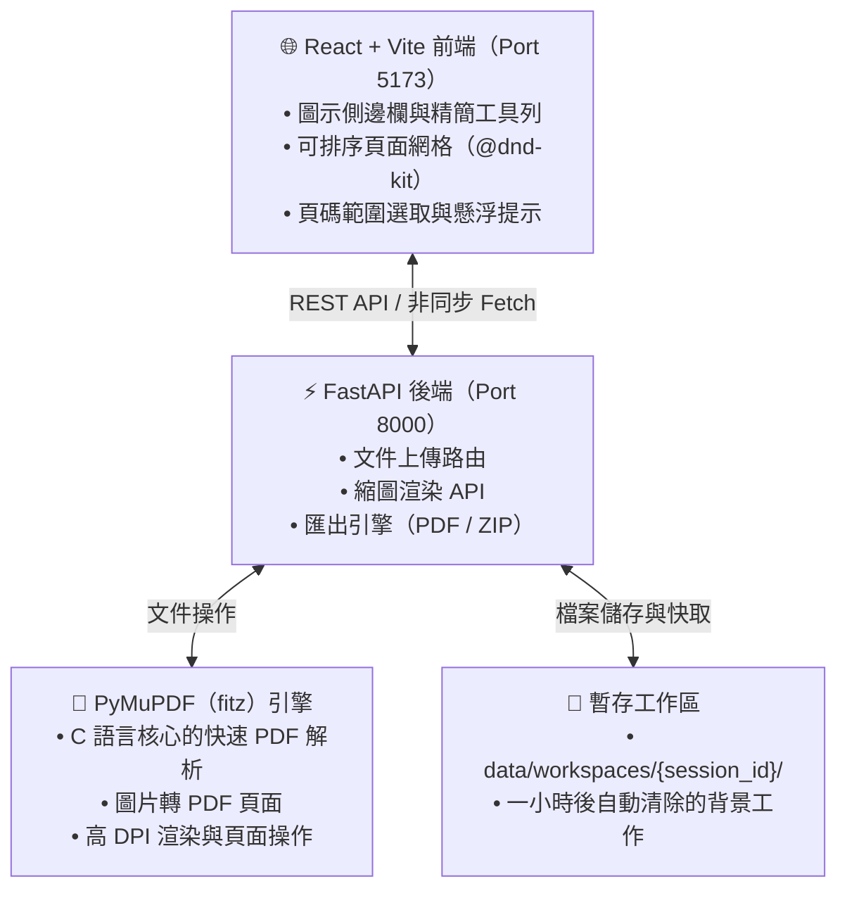

<div align="center" id="top">

**繁體中文** | [English](README.en.md)

<!-- HEADER STYLE: CLASSIC -->
<div align="center">

# walmart version of iLovePDF

<em>用拖的整理、合併、拆分 PDF，檔案不離開你的電腦。</em>

<!-- BADGES -->


<em>使用的工具與技術：</em>


</div>
<br>

</div>

---

## 目錄

- [概覽](#概覽)
- [架構](#架構)
- [功能特色](#功能特色)
- [專案結構](#專案結構)
    - [專案索引](#專案索引)
- [快速開始](#快速開始)
    - [方式 A 直接執行 Windows 程式](#方式-a-直接執行-windows-程式)
    - [方式 B 從原始碼執行](#方式-b-從原始碼執行)
    - [手動安裝](#手動安裝)
    - [測試](#測試)
- [建置 Windows 執行檔](#建置-windows-執行檔)
- [架構決策紀錄 ADR](#架構決策紀錄-adr)
- [參與貢獻](#參與貢獻)
- [授權](#授權)
- [致謝](#致謝)

---

## 概覽

**walmart version of iLovePDF** 是一個類似 iLovePDF 的 PDF 與圖片視覺化編輯工具。上傳的每個檔案、每一頁都會以縮圖卡片的形式排在同一個畫布上，你可以直接點選、拖曳排序、旋轉、刪除，再匯出成果——想打頁碼也可以，但不是必要。

**為什麼選擇 walmart version of iLovePDF？**

這個專案把逐頁編輯 PDF 變成「直接動手操作」，而且所有檔案都留在你自己的電腦上。主要功能包括：

- 🟦 **視覺化畫布：** 由 PyMuPDF 在伺服器端渲染縮圖，可跨多個檔案拖曳重新排序。
- 🟦 **密集的工作台介面：** 圖示側邊欄、精簡工具列、最多 8 欄的頁面網格，幾乎每個按鈕都有懸浮提示。
- 🟦 **兩種選取方式：** 點選卡片，或直接輸入範圍，例如 `1-5, 8, 12-20`。
- 🟩 **輸出 PDF 或圖片：** 匯出合併後的 PDF，或打包成 150 DPI 的 PNG ZIP 檔。
- 🟩 **預設就保護隱私：** 不用帳號、沒有資料庫，工作區閒置一小時後自動清除。
- 🟩 **單一檔案的 Windows 程式：** 只有一個 `WalmartPDF.exe`，使用者的電腦不需要安裝 Python 或 Node.js。

---

## 架構



打包成 `WalmartPDF.exe` 時，FastAPI 會從同一個網址直接提供已建置好的前端，整個程式只需要一個行程、一個 port。

---

## 功能特色

|      | 項目              | 細節 |
| :--- | :---------------- | :------ |
| ⚙️  | **架構**          | <ul><li>React SPA 與 FastAPI REST 後端分離</li><li>前端以扁平的 `PageNode[]` 保存頁面順序，匯出時由後端組合</li><li>打包模式為單一行程：FastAPI 透過 `StaticFiles` 掛載 `frontend/dist`</li><li>由 `lifespan` 背景工作清除閒置的工作區</li></ul> |
| 🔩 | **程式碼品質**    | <ul><li>前端全面使用 TypeScript</li><li>以 Pydantic 模型驗證匯出請求</li><li>卡片與工具列為無狀態、由 props 驅動的元件</li></ul> |
| 📄 | **文件**          | <ul><li>`docs/adr` 下有四份架構決策紀錄</li><li>`CONTEXT.md` 定義領域用語</li></ul> |
| 🔌 | **整合**          | <ul><li>`PyMuPDF` 負責解析、渲染與組合 PDF</li><li>`Pillow` 負責圖片驗證、縮圖與旋轉</li><li>`@dnd-kit` 負責拖曳排序</li><li>`PyInstaller` 負責打包成單一 Windows 執行檔</li></ul> |
| 🧩 | **模組化**        | <ul><li>後端分成 `api/`、`core/`、`services/`</li><li>前端分成 `Upload/`、`Canvas/`、`Toolbar/`，加上共用的 `Sidebar` 與 `Tooltip`</li></ul> |
| ⚡️  | **效能**          | <ul><li>C 語言核心的 MuPDF 渲染</li><li>約 300 px 的縮圖，第一次渲染後快取到磁碟</li><li>匯出時使用 `garbage=4`、`deflate=True` 壓縮</li></ul> |
| 🛡️ | **安全性**        | <ul><li>`session_id` 與檔名必須符合伺服器產生的 UUID 格式</li><li>檢查解析後的上傳路徑必須位於工作區內</li><li>檢查檔案實際內容（`%PDF-` 檔頭、`Image.verify()`），擋下改副檔名的檔案</li><li>上傳上限 50 MB</li><li>打包版只綁定 `127.0.0.1`</li></ul> |
| 📦 | **相依套件**      | <ul><li>後端：`fastapi`、`uvicorn[standard]`、`pymupdf`、`python-multipart`、`pydantic`、`pillow`</li><li>前端：`react`、`@dnd-kit/*`、`lucide-react`、`tailwindcss`、`vite`</li></ul> |

---

## 專案結構

```sh
└── walmart-ver.-of-iLovePDF/
    ├── .readmeaiignore
    ├── CONTEXT.md
    ├── LICENSE
    ├── README.md
    ├── README.en.md
    ├── WalmartPDF.spec
    ├── backend/
    │   ├── app/
    │   ├── desktop.py
    │   └── requirements.txt
    ├── build.ps1
    ├── docs/
    │   └── adr/
    ├── frontend/
    │   ├── index.html
    │   ├── package-lock.json
    │   ├── package.json
    │   ├── postcss.config.js
    │   ├── src/
    │   ├── tailwind.config.js
    │   ├── tsconfig.json
    │   └── vite.config.ts
    ├── start.bat
    ├── start.ps1
    └── start.sh
```

### 專案索引

<details open>
	<summary><b><code>WALMART-VER.-OF-ILOVEPDF/</code></b></summary>
	<!-- __root__ Submodule -->
	<details>
		<summary><b>__root__</b></summary>
		<blockquote>
			<div class='directory-path' style='padding: 8px 0; color: #666;'>
				<code><b>⦿ __root__</b></code>
			<table style='width: 100%; border-collapse: collapse;'>
			<thead>
				<tr style='background-color: #f8f9fa;'>
					<th style='width: 30%; text-align: left; padding: 8px;'>檔案</th>
					<th style='text-align: left; padding: 8px;'>說明</th>
				</tr>
			</thead>
				<tr style='border-bottom: 1px solid #eee;'>
					<td style='padding: 8px;'><b><a href='https://github.com/rowing195/walmart-ver.-of-iLovePDF/blob/main/build.ps1'>build.ps1</a></b></td>
					<td style='padding: 8px;'>產生可發佈的單一 Windows 執行檔。先確認 Node.js、npm、Python 都存在，以乾淨安裝的方式建置前端，再建立獨立的建置用虛擬環境，避免開發時裝的套件混進打包結果，接著安裝 PyInstaller 並執行 spec。每個階段失敗都會立刻停下並給出清楚訊息，最後回報執行檔大小。</td>
				</tr>
				<tr style='border-bottom: 1px solid #eee;'>
					<td style='padding: 8px;'><b><a href='https://github.com/rowing195/walmart-ver.-of-iLovePDF/blob/main/WalmartPDF.spec'>WalmartPDF.spec</a></b></td>
					<td style='padding: 8px;'>定義後端與建置好的前端如何被打包成單一的主控台執行檔。把正式版 SPA 當成資料一起打包、宣告靜態分析找不到的 uvicorn 子模組、排除 tkinter 以縮小檔案，並刻意關閉 UPX 壓縮，避免防毒軟體誤判以及原生函式庫損毀。</td>
				</tr>
				<tr style='border-bottom: 1px solid #eee;'>
					<td style='padding: 8px;'><b><a href='https://github.com/rowing195/walmart-ver.-of-iLovePDF/blob/main/start.bat'>start.bat</a></b></td>
					<td style='padding: 8px;'>在 Windows 上雙擊就能啟動完整的開發環境。缺少 Python 虛擬環境時會自動建立，安裝後端與前端套件後，同時啟動 FastAPI 伺服器與 Vite 開發伺服器；專案路徑含有空格也能正常運作，任何安裝步驟失敗都會顯示易讀的錯誤訊息。</td>
				</tr>
				<tr style='border-bottom: 1px solid #eee;'>
					<td style='padding: 8px;'><b><a href='https://github.com/rowing195/walmart-ver.-of-iLovePDF/blob/main/start.ps1'>start.ps1</a></b></td>
					<td style='padding: 8px;'>PowerShell 版的開發啟動腳本。準備好虛擬環境與相依套件後，分別開啟兩個視窗執行具自動重載的 uvicorn 後端與 Vite 前端，稍等兩者啟動，再用預設瀏覽器打開應用程式，讓開發者直接看到可用的畫布。</td>
				</tr>
				<tr style='border-bottom: 1px solid #eee;'>
					<td style='padding: 8px;'><b><a href='https://github.com/rowing195/walmart-ver.-of-iLovePDF/blob/main/start.sh'>start.sh</a></b></td>
					<td style='padding: 8px;'>在 Linux 與 macOS 上啟動開發環境。建立並啟用虛擬環境、安裝前後端相依套件，以背景工作執行 uvicorn 與 Vite 開發伺服器，並註冊結束時的清理動作，關掉腳本時會一併停止兩個伺服器，不會留下孤兒行程。</td>
				</tr>
				<tr style='border-bottom: 1px solid #eee;'>
					<td style='padding: 8px;'><b><a href='https://github.com/rowing195/walmart-ver.-of-iLovePDF/blob/main/CONTEXT.md'>CONTEXT.md</a></b></td>
					<td style='padding: 8px;'>建立程式碼與文件共用的領域用語。定義 Document 為上傳的 PDF 或圖片、Page Node 為編輯的最小單位、Visual Canvas 為排列頁面的畫布，以及 Export Job 如何把畫布狀態轉成合併後的 PDF 或頁面圖片的 ZIP 檔。</td>
				</tr>
			</table>
		</blockquote>
	</details>
	<!-- backend Submodule -->
	<details>
		<summary><b>backend</b></summary>
		<blockquote>
			<div class='directory-path' style='padding: 8px 0; color: #666;'>
				<code><b>⦿ backend</b></code>
			<table style='width: 100%; border-collapse: collapse;'>
			<thead>
				<tr style='background-color: #f8f9fa;'>
					<th style='width: 30%; text-align: left; padding: 8px;'>檔案</th>
					<th style='text-align: left; padding: 8px;'>說明</th>
				</tr>
			</thead>
				<tr style='border-bottom: 1px solid #eee;'>
					<td style='padding: 8px;'><b><a href='https://github.com/rowing195/walmart-ver.-of-iLovePDF/blob/main/backend/desktop.py'>desktop.py</a></b></td>
					<td style='padding: 8px;'>打包進 Windows 執行檔的程式進入點。優先使用 port 8000，被占用時改用任一可用的 port，在主控台印出執行網址，並等到伺服器真的能接受連線才打開瀏覽器。uvicorn 在主執行緒上直接執行匯入的 app 物件，讓打包後的行為可預期、也能乾淨地結束。</td>
				</tr>
				<tr style='border-bottom: 1px solid #eee;'>
					<td style='padding: 8px;'><b><a href='https://github.com/rowing195/walmart-ver.-of-iLovePDF/blob/main/backend/requirements.txt'>requirements.txt</a></b></td>
					<td style='padding: 8px;'>鎖定開發與打包共用的後端套件版本。包含 FastAPI 網頁框架、附標準擴充的 uvicorn ASGI 伺服器、處理文件的 PyMuPDF、處理檔案上傳的 python-multipart、驗證請求的 Pydantic，以及負責圖片驗證、縮圖與旋轉的 Pillow。</td>
				</tr>
			</table>
			<!-- app Submodule -->
			<details>
				<summary><b>app</b></summary>
				<blockquote>
					<div class='directory-path' style='padding: 8px 0; color: #666;'>
						<code><b>⦿ backend.app</b></code>
					<table style='width: 100%; border-collapse: collapse;'>
					<thead>
						<tr style='background-color: #f8f9fa;'>
							<th style='width: 30%; text-align: left; padding: 8px;'>檔案</th>
							<th style='text-align: left; padding: 8px;'>說明</th>
						</tr>
					</thead>
						<tr style='border-bottom: 1px solid #eee;'>
							<td style='padding: 8px;'><b><a href='https://github.com/rowing195/walmart-ver.-of-iLovePDF/blob/main/backend/app/main.py'>main.py</a></b></td>
							<td style='padding: 8px;'>組裝 FastAPI 應用程式。設定本機開發用的 CORS、把所有 API 路由掛在 api 前綴下、提供健康檢查端點，並透過 lifespan 執行工作區清理迴圈，關閉時會一併取消。如果有建置好的前端，也會從同一個網址提供單頁應用程式，供打包模式使用。</td>
						</tr>
					</table>
					<!-- api Submodule -->
					<details>
						<summary><b>api</b></summary>
						<blockquote>
							<div class='directory-path' style='padding: 8px 0; color: #666;'>
								<code><b>⦿ backend.app.api</b></code>
							<table style='width: 100%; border-collapse: collapse;'>
							<thead>
								<tr style='background-color: #f8f9fa;'>
									<th style='width: 30%; text-align: left; padding: 8px;'>檔案</th>
									<th style='text-align: left; padding: 8px;'>說明</th>
								</tr>
							</thead>
								<tr style='border-bottom: 1px solid #eee;'>
									<td style='padding: 8px;'><b><a href='https://github.com/rowing195/walmart-ver.-of-iLovePDF/blob/main/backend/app/api/router.py'>router.py</a></b></td>
									<td style='padding: 8px;'>把各功能的路由合併成應用程式使用的單一 API 路由。文件處理掛在 documents 前綴、匯出掛在 export 前綴，並各自加上標籤，讓自動產生的 OpenAPI 文件依職責分組，而不是一整串平鋪的端點。</td>
								</tr>
								<tr style='border-bottom: 1px solid #eee;'>
									<td style='padding: 8px;'><b><a href='https://github.com/rowing195/walmart-ver.-of-iLovePDF/blob/main/backend/app/api/endpoints/documents.py'>endpoints/documents.py</a></b></td>
									<td style='padding: 8px;'>處理文件上傳與頁面預覽。接收 PDF 與圖片、檢查允許的副檔名與大小上限、檢查實際檔案內容以擋下偽裝的檔案，存進該工作階段的工作區並回傳頁面資訊。也提供每一頁的縮圖，第一次請求時透過 PDF 服務渲染，之後直接讀取快取。</td>
								</tr>
								<tr style='border-bottom: 1px solid #eee;'>
									<td style='padding: 8px;'><b><a href='https://github.com/rowing195/walmart-ver.-of-iLovePDF/blob/main/backend/app/api/endpoints/export.py'>endpoints/export.py</a></b></td>
									<td style='padding: 8px;'>把前端送來的畫布狀態轉成可下載的檔案。驗證依序排列、含旋轉角度的頁面清單，拒絕不是伺服器產生的檔名，再交給 PDF 服務產生合併後的單一 PDF，或是打包成頁面圖片的 ZIP 檔。</td>
								</tr>
							</table>
						</blockquote>
					</details>
					<!-- core Submodule -->
					<details>
						<summary><b>core</b></summary>
						<blockquote>
							<div class='directory-path' style='padding: 8px 0; color: #666;'>
								<code><b>⦿ backend.app.core</b></code>
							<table style='width: 100%; border-collapse: collapse;'>
							<thead>
								<tr style='background-color: #f8f9fa;'>
									<th style='width: 30%; text-align: left; padding: 8px;'>檔案</th>
									<th style='text-align: left; padding: 8px;'>說明</th>
								</tr>
							</thead>
								<tr style='border-bottom: 1px solid #eee;'>
									<td style='padding: 8px;'><b><a href='https://github.com/rowing195/walmart-ver.-of-iLovePDF/blob/main/backend/app/core/config.py'>config.py</a></b></td>
									<td style='padding: 8px;'>集中管理執行設定與路徑。偵測程式是否在打包後的執行檔內執行，若是，就從解壓縮目錄讀取打包的資源，並把使用者資料放在本機應用程式資料夾。同時定義工作區一小時的存活時間、上傳大小上限，以及用來驗證識別碼的 UUID 格式。</td>
								</tr>
								<tr style='border-bottom: 1px solid #eee;'>
									<td style='padding: 8px;'><b><a href='https://github.com/rowing195/walmart-ver.-of-iLovePDF/blob/main/backend/app/core/cleanup.py'>cleanup.py</a></b></td>
									<td style='padding: 8px;'>實作支撐隱私承諾的背景清理機制。每十分鐘檢查一次所有工作區，刪除最後修改時間超過存活時間的工作區；刪除失敗只會記錄下來、不會讓迴圈中斷，單一被鎖住的檔案不會影響其他工作區的清理。</td>
								</tr>
							</table>
						</blockquote>
					</details>
					<!-- services Submodule -->
					<details>
						<summary><b>services</b></summary>
						<blockquote>
							<div class='directory-path' style='padding: 8px 0; color: #666;'>
								<code><b>⦿ backend.app.services</b></code>
							<table style='width: 100%; border-collapse: collapse;'>
							<thead>
								<tr style='background-color: #f8f9fa;'>
									<th style='width: 30%; text-align: left; padding: 8px;'>檔案</th>
									<th style='text-align: left; padding: 8px;'>說明</th>
								</tr>
							</thead>
								<tr style='border-bottom: 1px solid #eee;'>
									<td style='padding: 8px;'><b><a href='https://github.com/rowing195/walmart-ver.-of-iLovePDF/blob/main/backend/app/services/pdf_service.py'>pdf_service.py</a></b></td>
									<td style='padding: 8px;'>用 PyMuPDF 與 Pillow 處理所有文件工作。讀取頁數與尺寸、渲染並快取小縮圖、把圖片轉成 PDF 頁面、把依序排列且旋轉過的頁面組合成一份壓縮過的 PDF，也能把選取的頁面渲染成 PNG 並打包成 ZIP 供下載。</td>
								</tr>
								<tr style='border-bottom: 1px solid #eee;'>
									<td style='padding: 8px;'><b><a href='https://github.com/rowing195/walmart-ver.-of-iLovePDF/blob/main/backend/app/services/workspace_service.py'>workspace_service.py</a></b></td>
									<td style='padding: 8px;'>管理每個工作階段在磁碟上的儲存空間。建立以 UUID 命名、含上傳、縮圖、匯出資料夾的工作區，以伺服器產生的檔名儲存上傳檔案，而且只有在路徑確實位於上傳資料夾內時才會解析成實際路徑，防止透過使用者提供的識別碼進行路徑穿越。</td>
								</tr>
							</table>
						</blockquote>
					</details>
				</blockquote>
			</details>
		</blockquote>
	</details>
	<!-- frontend Submodule -->
	<details>
		<summary><b>frontend</b></summary>
		<blockquote>
			<div class='directory-path' style='padding: 8px 0; color: #666;'>
				<code><b>⦿ frontend</b></code>
			<table style='width: 100%; border-collapse: collapse;'>
			<thead>
				<tr style='background-color: #f8f9fa;'>
					<th style='width: 30%; text-align: left; padding: 8px;'>檔案</th>
					<th style='text-align: left; padding: 8px;'>說明</th>
				</tr>
			</thead>
				<tr style='border-bottom: 1px solid #eee;'>
					<td style='padding: 8px;'><b><a href='https://github.com/rowing195/walmart-ver.-of-iLovePDF/blob/main/frontend/package.json'>package.json</a></b></td>
					<td style='padding: 8px;'>宣告前端套件、指令與相依套件。提供 Vite 的開發、含型別檢查的正式建置，以及預覽指令；執行期依賴 React、dnd-kit 拖曳套件與 Lucide 圖示，建置期工具則有 TypeScript、Tailwind CSS、PostCSS 與 Vite 的 React 外掛。</td>
				</tr>
				<tr style='border-bottom: 1px solid #eee;'>
					<td style='padding: 8px;'><b><a href='https://github.com/rowing195/walmart-ver.-of-iLovePDF/blob/main/frontend/vite.config.ts'>vite.config.ts</a></b></td>
					<td style='padding: 8px;'>設定 React 應用程式的 Vite 開發伺服器。開發 port 固定為 5173，並把所有 api 請求代理到 port 8000 的 FastAPI 後端，讓前端用相對網址就能在開發環境與單一網址的打包版中一樣運作，不需要任何依環境切換的程式碼。</td>
				</tr>
				<tr style='border-bottom: 1px solid #eee;'>
					<td style='padding: 8px;'><b><a href='https://github.com/rowing195/walmart-ver.-of-iLovePDF/blob/main/frontend/tailwind.config.js'>tailwind.config.js</a></b></td>
					<td style='padding: 8px;'>設定 Tailwind CSS 的掃描範圍與主題擴充。內容偵測涵蓋 HTML 外殼與所有 TypeScript 原始碼，並把 sans 與 mono 字體對應到 IBM Plex Sans 與 IBM Plex Mono，讓工作台的標籤、徽章與檔名有一致的字體。</td>
				</tr>
				<tr style='border-bottom: 1px solid #eee;'>
					<td style='padding: 8px;'><b><a href='https://github.com/rowing195/walmart-ver.-of-iLovePDF/blob/main/frontend/index.html'>index.html</a></b></td>
					<td style='padding: 8px;'>Vite 用來注入 React 應用程式的 HTML 外殼。從 Google Fonts 載入 IBM Plex 字體家族，在 body 層級設定深色背景、文字顏色與選取反白，並提供整個工作台介面在執行時掛載的根元素。</td>
				</tr>
			</table>
			<!-- src Submodule -->
			<details>
				<summary><b>src</b></summary>
				<blockquote>
					<div class='directory-path' style='padding: 8px 0; color: #666;'>
						<code><b>⦿ frontend.src</b></code>
					<table style='width: 100%; border-collapse: collapse;'>
					<thead>
						<tr style='background-color: #f8f9fa;'>
							<th style='width: 30%; text-align: left; padding: 8px;'>檔案</th>
							<th style='text-align: left; padding: 8px;'>說明</th>
						</tr>
					</thead>
						<tr style='border-bottom: 1px solid #eee;'>
							<td style='padding: 8px;'><b><a href='https://github.com/rowing195/walmart-ver.-of-iLovePDF/blob/main/frontend/src/App.tsx'>App.tsx</a></b></td>
							<td style='padding: 8px;'>掌管整個工作台的狀態與版面。保存工作階段、依序排列的頁面節點，以及選取、旋轉、範圍選取的處理邏輯，還有會觸發下載的上傳與匯出流程。負責渲染側邊欄、含工作區倒數計時的頁首、浮動通知，以及全尺寸的拖放上傳區或工具列加頁面網格。</td>
						</tr>
						<tr style='border-bottom: 1px solid #eee;'>
							<td style='padding: 8px;'><b><a href='https://github.com/rowing195/walmart-ver.-of-iLovePDF/blob/main/frontend/src/index.css'>index.css</a></b></td>
							<td style='padding: 8px;'>在 Tailwind 之上定義全域樣式。設定 IBM Plex 字體、防止整個頁面水平捲動、把捲軸配成藍色主題色，並實作懸浮提示：滑鼠停留一秒後顯示、移開立刻消失，支援下方、上方與右側三種位置並附箭頭。</td>
						</tr>
						<tr style='border-bottom: 1px solid #eee;'>
							<td style='padding: 8px;'><b><a href='https://github.com/rowing195/walmart-ver.-of-iLovePDF/blob/main/frontend/src/main.tsx'>main.tsx</a></b></td>
							<td style='padding: 8px;'>啟動 React 應用程式。匯入全域樣式表、找到 HTML 外殼中的根元素，並在 React 嚴格模式下渲染主要的 App 元件；嚴格模式會在開發時揭露不安全的生命週期用法與意外副作用，不影響打包進執行檔的正式版。</td>
						</tr>
					</table>
					<!-- components Submodule -->
					<details>
						<summary><b>components</b></summary>
						<blockquote>
							<div class='directory-path' style='padding: 8px 0; color: #666;'>
								<code><b>⦿ frontend.src.components</b></code>
							<table style='width: 100%; border-collapse: collapse;'>
							<thead>
								<tr style='background-color: #f8f9fa;'>
									<th style='width: 30%; text-align: left; padding: 8px;'>檔案</th>
									<th style='text-align: left; padding: 8px;'>說明</th>
								</tr>
							</thead>
								<tr style='border-bottom: 1px solid #eee;'>
									<td style='padding: 8px;'><b><a href='https://github.com/rowing195/walmart-ver.-of-iLovePDF/blob/main/frontend/src/components/Sidebar.tsx'>Sidebar.tsx</a></b></td>
									<td style='padding: 8px;'>在工作台左側渲染窄版的圖示導覽列。顯示產品標誌、目前所在的頁面總覽，以及標示「即將推出」的圖層、版本記錄與工作區設定；每個圖示都有懸浮提示與無障礙名稱，讓精簡的圖示對新使用者也一看就懂。</td>
								</tr>
								<tr style='border-bottom: 1px solid #eee;'>
									<td style='padding: 8px;'><b><a href='https://github.com/rowing195/walmart-ver.-of-iLovePDF/blob/main/frontend/src/components/Tooltip.tsx'>Tooltip.tsx</a></b></td>
									<td style='padding: 8px;'>提供輕量、可重複使用的懸浮提示包裝元件。包住任何控制項，並附上放在下方、上方或右側的說明泡泡，延遲顯示的效果完全交給共用樣式表處理，讓工具列、側邊欄與頁面卡片不必占用任何固定版面就能自我說明。</td>
								</tr>
								<tr style='border-bottom: 1px solid #eee;'>
									<td style='padding: 8px;'><b><a href='https://github.com/rowing195/walmart-ver.-of-iLovePDF/blob/main/frontend/src/components/Upload/FileUploader.tsx'>Upload/FileUploader.tsx</a></b></td>
									<td style='padding: 8px;'>顯示佔滿大部分工作區的空白狀態拖放上傳區。可以拖放檔案，或透過只接受 PDF 與常見圖片格式的隱藏檔案選擇器上傳，交給應用程式處理；頁面上傳與渲染期間，圖示會換成讀取中的動畫。</td>
								</tr>
								<tr style='border-bottom: 1px solid #eee;'>
									<td style='padding: 8px;'><b><a href='https://github.com/rowing195/walmart-ver.-of-iLovePDF/blob/main/frontend/src/components/Toolbar/ActionsToolbar.tsx'>Toolbar/ActionsToolbar.tsx</a></b></td>
									<td style='padding: 8px;'>把所有批次操作集中在一條精簡的工具列。可以插入更多檔案、切換全選、把 1-5, 8 這類頁碼範圍即時轉成選取並標示無效輸入、旋轉或刪除選取的頁面、顯示已選數量，以及匯出合併 PDF 或 PNG ZIP，每個控制項都有懸浮提示。</td>
								</tr>
								<tr style='border-bottom: 1px solid #eee;'>
									<td style='padding: 8px;'><b><a href='https://github.com/rowing195/walmart-ver.-of-iLovePDF/blob/main/frontend/src/components/Canvas/VisualCanvas.tsx'>Canvas/VisualCanvas.tsx</a></b></td>
									<td style='padding: 8px;'>把所有頁面卡片排成最多八欄的響應式網格，並讓它們可以排序。設定 dnd-kit 的指標與鍵盤感應器，加上小段的啟動距離，避免點擊被誤判成拖曳；拖曳結束時把重新排序後的頁面清單寫回應用程式。</td>
								</tr>
								<tr style='border-bottom: 1px solid #eee;'>
									<td style='padding: 8px;'><b><a href='https://github.com/rowing195/walmart-ver.-of-iLovePDF/blob/main/frontend/src/components/Canvas/PageCard.tsx'>Canvas/PageCard.tsx</a></b></td>
									<td style='padding: 8px;'>以可拖曳的卡片顯示單一頁面。包含來源檔名、依目前角度旋轉的伺服器端縮圖、頁碼與旋轉角度標籤，以及選取、左右旋轉與刪除的控制項；只有在拖曳時才提高堆疊順序，避免蓋住相鄰卡片的懸浮提示。</td>
								</tr>
							</table>
						</blockquote>
					</details>
					<!-- services Submodule -->
					<details>
						<summary><b>services</b></summary>
						<blockquote>
							<div class='directory-path' style='padding: 8px 0; color: #666;'>
								<code><b>⦿ frontend.src.services</b></code>
							<table style='width: 100%; border-collapse: collapse;'>
							<thead>
								<tr style='background-color: #f8f9fa;'>
									<th style='width: 30%; text-align: left; padding: 8px;'>檔案</th>
									<th style='text-align: left; padding: 8px;'>說明</th>
								</tr>
							</thead>
								<tr style='border-bottom: 1px solid #eee;'>
									<td style='padding: 8px;'><b><a href='https://github.com/rowing195/walmart-ver.-of-iLovePDF/blob/main/frontend/src/services/api.ts'>api.ts</a></b></td>
									<td style='padding: 8px;'>包裝介面用到的所有後端呼叫。以 multipart 表單上傳檔案並沿用目前的工作階段、為頁面卡片產生縮圖網址，並送出匯出請求以取得合併 PDF 或 ZIP 的二進位資料；請求失敗時轉成易讀的錯誤訊息，透過浮動通知顯示。</td>
								</tr>
							</table>
						</blockquote>
					</details>
					<!-- types Submodule -->
					<details>
						<summary><b>types</b></summary>
						<blockquote>
							<div class='directory-path' style='padding: 8px 0; color: #666;'>
								<code><b>⦿ frontend.src.types</b></code>
							<table style='width: 100%; border-collapse: collapse;'>
							<thead>
								<tr style='background-color: #f8f9fa;'>
									<th style='width: 30%; text-align: left; padding: 8px;'>檔案</th>
									<th style='text-align: left; padding: 8px;'>說明</th>
								</tr>
							</thead>
								<tr style='border-bottom: 1px solid #eee;'>
									<td style='padding: 8px;'><b><a href='https://github.com/rowing195/walmart-ver.-of-iLovePDF/blob/main/frontend/src/types/index.ts'>index.ts</a></b></td>
									<td style='padding: 8px;'>定義元件之間、以及與後端交換資料時共用的 TypeScript 型別。描述含頁面尺寸的上傳文件、代表一張卡片的頁面節點（來源、頁碼、旋轉角度、選取狀態），以及把依序排列、含旋轉資訊的頁面清單送到伺服器的匯出請求。</td>
								</tr>
							</table>
						</blockquote>
					</details>
				</blockquote>
			</details>
		</blockquote>
	</details>
</details>

---

## 快速開始

### 方式 A 直接執行 Windows 程式

**不用裝 Python、不用裝 Node.js、不用安裝。** 從[最新版本](https://github.com/rowing195/walmart-ver.-of-iLovePDF/releases/latest)下載 `WalmartPDF.exe`，雙擊就能執行。

它會啟動本機伺服器、自動打開瀏覽器，整個應用程式都由這一個檔案提供。所有處理都在你的電腦上進行，不會上傳到任何地方。

> [!NOTE]
> **第一次執行會出現 SmartScreen 警告。** 這個執行檔沒有程式碼簽章，Windows 會顯示「Windows 已保護您的電腦」。
> 點 **其他資訊 → 仍要執行** 即可，任何沒有簽章的程式都會這樣。

程式執行時會有一個黑色主控台視窗，**關掉它就會結束程式**。
工作中的檔案存放在 `%LOCALAPPDATA%\WalmartPDF\workspaces`，工作階段閒置一小時後會自動清除。

如果 port `8000` 已被占用，程式會自動改用其他可用的 port，並用那個網址打開瀏覽器。

---

### 方式 B 從原始碼執行

**需求**

- **程式語言：** Python `3.10+`、TypeScript
- **套件管理：** pip、npm（Node.js `18+`）

在 Windows 上，直接雙擊專案根目錄的 **`start.bat`**（macOS / Linux 執行 `./start.sh`）。

腳本會自動：
1. 若不存在，建立 Python 虛擬環境（`.venv`）。
2. 安裝 Python 相依套件（`pymupdf`、`fastapi`、`uvicorn` 等）。
3. 安裝前端 `npm` 套件。
4. 在 `http://localhost:8000` 啟動 FastAPI 後端，在 `http://localhost:5173` 啟動 Vite 前端。
5. 自動打開預設瀏覽器。

這是開發用的環境：Vite 開發伺服器支援熱重載，並把 `/api` 請求代理到後端。

---

### 手動安裝

1. **複製專案：**

    ```sh
    ❯ git clone https://github.com/rowing195/walmart-ver.-of-iLovePDF
    ```

2. **進入專案資料夾：**

    ```sh
    ❯ cd walmart-ver.-of-iLovePDF
    ```

3. **安裝並啟動後端：**

    ```sh
    ❯ python -m venv .venv
    ❯ source .venv/bin/activate  # Windows：.venv\Scripts\activate
    ❯ pip install -r backend/requirements.txt
    ❯ python -m uvicorn app.main:app --reload --port 8000 --app-dir backend
    ```

4. **另開一個終端機，安裝並啟動前端：**

    ```sh
    ❯ cd frontend
    ❯ npm install
    ❯ npm run dev
    ```

用瀏覽器打開 `http://localhost:5173`。

---

### 測試

專案目前還沒有自動化測試。前端建置時會執行 TypeScript 型別檢查：

```sh
❯ cd frontend
❯ npm run build
```

---

## 建置 Windows 執行檔

在專案根目錄的 PowerShell 執行：

```powershell
.\build.ps1
```

如果 PowerShell 顯示「因為這個系統上已停用指令碼執行」，代表你的執行原則擋住了本機指令碼，改用這個方式執行一次即可：

```powershell
powershell -ExecutionPolicy Bypass -File build.ps1
```

產出的是 **`dist\WalmartPDF.exe`**（約 40 MB），一個獨立的單一檔案，在沒有安裝 Python 或 Node.js 的 Windows 電腦上也能執行。

**腳本做了什麼：**

| 步驟 | 動作 |
| :--- | :--- |
| 1 | 確認 `node`、`npm`、`python` 都在 `PATH` 上 |
| 2 | `npm ci` + `npm run build` → 產生 `frontend/dist` |
| 3 | 建立 `.build-venv`，安裝後端套件與 PyInstaller |
| 4 | 用 `WalmartPDF.spec` 執行 PyInstaller |

**建置需求**（使用者本身都不需要）：

- **Windows**：PyInstaller 無法跨平台編譯，Windows 的 `.exe` 必須在 Windows 上建置。
- Node.js `18+` 與 Python `3.10+`。

> [!IMPORTANT]
> **重新建置前，先關掉正在執行的 `WalmartPDF.exe`。** 執行中的程式會鎖住 `dist\WalmartPDF.exe`，
> PyInstaller 會失敗並出現 `PermissionError: [WinError 5] 存取被拒`：
> ```powershell
> Stop-Process -Name WalmartPDF -Force -ErrorAction SilentlyContinue
> ```

第一次建置需要幾分鐘（`npm ci` 加上建立虛擬環境）；之後會重複使用 `.build-venv`，大約兩分鐘。

**有任何修改都要重新建置。** 執行檔裡的前端是建置當下 `frontend/dist` 的快照，不會自己更新。開發時請用 `start.bat` 享有熱重載，確定改好了再打包。

### 打包版與開發模式的差異

| | 開發模式（`start.bat`） | 打包版（`WalmartPDF.exe`） |
| :--- | :--- | :--- |
| 行程 | 兩個（Vite `5173` + FastAPI `8000`） | 一個，API 與介面共用同一個 port |
| 前端 | Vite 開發伺服器，支援熱重載 | 由 FastAPI 提供預先建置好的靜態檔案 |
| Port | 固定 `5173` / `8000` | 優先使用 `8000`，被占用時改用任一可用 port |
| 工作資料 | `backend/data/workspaces` | `%LOCALAPPDATA%\WalmartPDF\workspaces` |

---

## 架構決策紀錄 ADR

walmart version of iLovePDF 的主要設計決策都記錄在 [docs/adr](docs/adr)（英文）：

- [ADR 0001：使用 PyMuPDF 在伺服器端渲染縮圖](docs/adr/0001-server-side-thumbnail-rendering-with-pymupdf.md)
- [ADR 0002：不使用資料庫的本機暫存工作區](docs/adr/0002-ephemeral-local-session-storage.md)
- [ADR 0003：技術選型：FastAPI 與 React](docs/adr/0003-tech-stack-fastapi-react.md)
- [ADR 0004：本機開發的一鍵啟動腳本](docs/adr/0004-one-command-startup-script.md)

---

## 參與貢獻

- **🐛 [回報問題](https://github.com/rowing195/walmart-ver.-of-iLovePDF/issues)**：回報 bug 或提出功能需求。
- **💡 [提交 Pull Request](https://github.com/rowing195/walmart-ver.-of-iLovePDF/pulls)**：審閱現有的 PR，或送出你自己的 PR。

<details closed>
<summary>貢獻流程</summary>

1. **Fork 專案**：先把專案 fork 到你的 GitHub 帳號。
2. **複製到本機**：用 git 把 fork 後的專案複製到你的電腦。
   ```sh
   git clone https://github.com/rowing195/walmart-ver.-of-iLovePDF
   ```
3. **建立新分支**：每次都在新分支上工作，並取個清楚的名字。
   ```sh
   git checkout -b new-feature-x
   ```
4. **進行修改**：在本機開發並測試。
5. **提交修改**：用清楚描述改動的訊息提交。
   ```sh
   git commit -m 'Implemented new feature x.'
   ```
6. **推送到 GitHub**：把修改推送到你 fork 的專案。
   ```sh
   git push origin new-feature-x
   ```
7. **送出 Pull Request**：對原始專案建立 PR。
8. **審閱**：PR 經過審閱並核准後就會合併。

</details>

<details closed>
<summary>貢獻者</summary>
<br>
<p align="left">
   <a href="https://github.com/rowing195/walmart-ver.-of-iLovePDF/graphs/contributors">
      
   </a>
</p>
</details>

---

## 授權

walmart version of iLovePDF 採用 [MIT](LICENSE) 授權。

---

## 致謝

- 靈感來自 [iLovePDF](https://www.ilovepdf.com/)；本專案是獨立的仿作，與其沒有任何關係。
- [PyMuPDF](https://github.com/pymupdf/PyMuPDF)：PDF 解析、渲染與組合。
- [FastAPI](https://github.com/fastapi/fastapi) 與 [Uvicorn](https://github.com/encode/uvicorn)：後端。
- [dnd kit](https://github.com/clauderic/dnd-kit)：拖曳排序。
- [Lucide](https://github.com/lucide-icons/lucide)：圖示。
- [PyInstaller](https://github.com/pyinstaller/pyinstaller)：打包成單一 Windows 執行檔。

<div align="left"><a href="#top">回到頂端</a></div>

---
